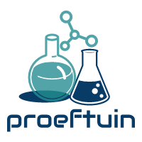
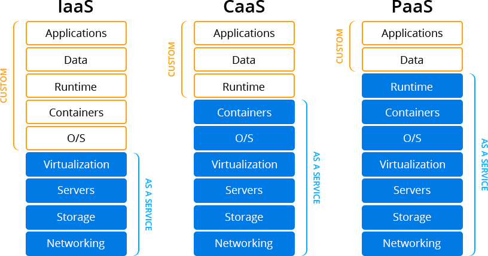
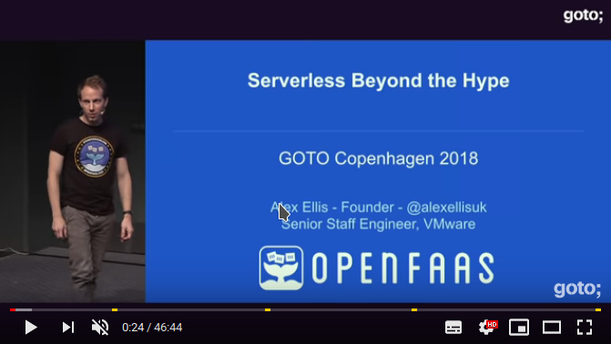
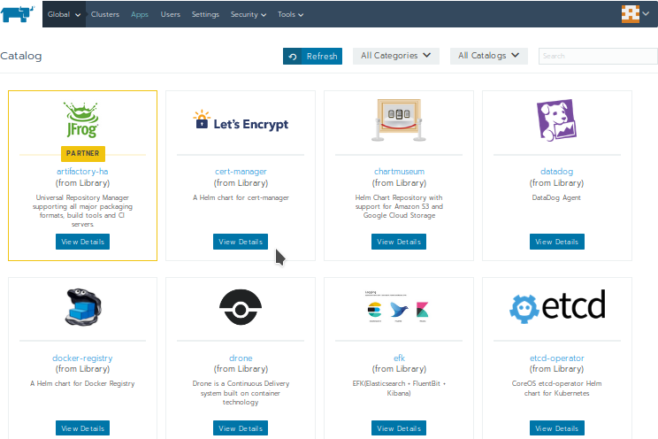
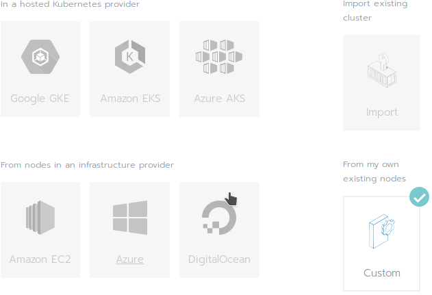
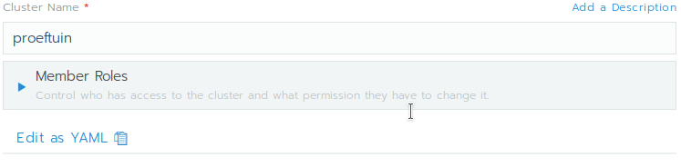
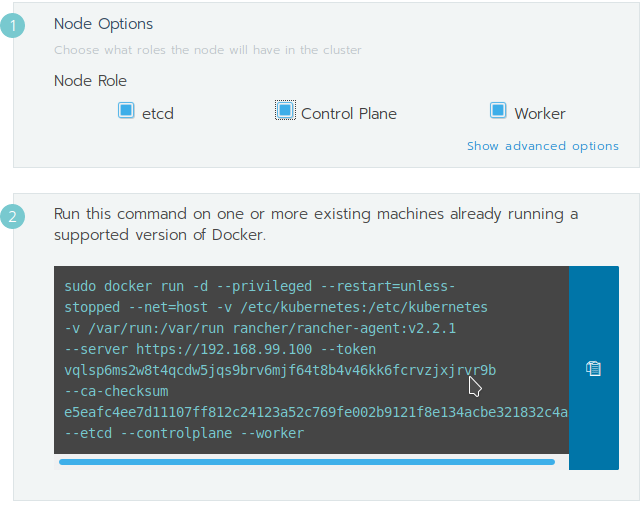
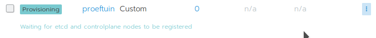

# Innovatie Proeftuin



De innovatie proeftuin geeft ons de mogeljkheid om laagdrempelig nieuwe innovatieve ideeen uit te proberen.
Doel is om een brede community te voorzien van de proeftuin binnen de publiek/privaat sector en scholen waarbij iedereen apps kan bouwen t.b.v. de sociale domeinen zorg, werk en inkomen met open source tooling en open standaarden.

## Functionaliteiten

De proeftuin zet in eerste instantie een single node CaaS op middels docker-machine. De standaard driver die hiervoor gebruikt wordt is VirtualBox voor locale installaties t.b.v. laagdrempelig ontwikkelen. Daarnaast is het mogelijk om het script uit naar andere drivers, varieerend van on-prem / (multi)cloud. De multicloud omgeving is te beheren vanuit Rancher 2.0. (de Paas Runtime)



Op de PaaS biedt de proeftuin ook mogelijkheden tot FaaS (functions as a service) Via OpenFaas
Deze presentatie geeft een goede overview van de mogelijkheden.

[](https://www.youtube.com/watch?v=yOpYYYRuDQ0)

### SaaS

Het horizontaal lagen model (5 lagen) van de referentie architectuur met de SaaS componenten waarmee apps gemaakt kunnen worden vind je hier:

https://github.com/sjefvanleeuwen/fieldlab-reference-architecture

Deze wordt momenteel nog uitgerold als docker containers / infrastructure as code. Deze zullen omgeschreven worden naar Helm Charts voor Kubernetes zodat ze ook gemanaged beheerd kunnen worden vanuit de Rancher Catalog.

Voorbeeld van deze store:

[]

### Versie 1.0
- IAAS/CAAS/PAAS/FAAS (Serverless)
- Uitrol van containers as a service (CAAS) middels docker-machine
- Support voor meerdere Local de machine / private / public cloud providers
    - VirtualBox
    - VM VSPhere
    - Google / Amazon / Azure

### Toekomstige versies
- multi node kubernetes (elasticity)
- multi cluster (fail-over datacenters)

## Installeren

Deze instructies beschrijven hoe een kopie van het project up-and-running te krijgen is op een lokale omgeving ten behoeve van ontwikkeling en testen.

Hier zie je een installatiee sessie (bash) opgenomen met asciinema. 
[](https://asciinema.org/a/ejLFhoTOt0imT9i8O5Xhsa9z2)

### Vereisten

- OpenSSL
- Docker Machine

### deployment

#### Setup script

Het volgende script maakt de docker machine aan met het Rancher 20 en de benodigde beveiligingscertificaten met een server en root ca cert.
Zowel de Root CA Cert en Server Cert zijn self signed, uiteraard kun je als je wilt een server Cert maken op basis van een public CA zoals Verisign. Ook de wachtwoorden (passphrases) voor de private keys kun je aanpassen. Het script deployed eveneens een kubernetes cluster single node.

```console
foo@bar:~$ ./deploy-vm.sh
```

#### Rancher configuratie (web interface)

Nadat het script klaar is kun je inloggen op rancher via https://192.168.99.100/ maak een wachtwoord aan in het systeem zoals gevraagd. Ga vervolgens naar het menu: Clusters en creer een Custom Cluster.

]

Scroll naar beneden en bij "Cluster Name" vul je "proeftuin" in.

]

Klik op next en vul vervolgens in het formulier de volgende rollen in etc, control plane en worker aanvinken:

]

Kopieer het script, deze gaan we iets aangepast uitvoeren in bash via docker-machine.

Het gegeneerde script prefixen we met:

```console
sudo docker-machine ssh proeftuin
```

Via SSH gaan we op de proeftuin machine het proeftuin cluster met een custom node installeren met kubernetes (k8s).

Uiteindelijk ziet het script er ongeveer zo uit (bij elke installatie zijn de hashes anders).

```console
sudo docker-machine ssh proeftuin docker run -d --privileged --restart=unless-stopped --net=host -v /etc/kubernetes:/etc/kubernetes -v /var/run:/var/run rancher/rancher-agent:v2.2.1 --server https://192.168.99.100 --token qpm2t8tt6rwb62s5sncczxmfkfdxmgkkd7wsx9s5ngpvxv5xgb276s --ca-checksum 8ac7c94b59a17d6fd2464c19acfcf8a82c7b53d678b6ebf2dbe4adccb35997bf --etcd --controlplane --worker
```

In de web browser van Rancher verschijnt na uitvoering het volgende:

]

Wacht tot de node klaar is met provisioning.

### Technologie voor devops

Er wordt gebruik gemaakt van de volgende (open source) technology-stack:

- Docker-Machine
- Rancher 2.0 OS
- Kubernetes
- Rancher 2.0
- OpenFAAS

## Licentie (Licence)

Licensed under the EUPL. This project is licensed under the MIT License - see the [LICENSE.md](◄LICENSE.md) file for details.
> Copyright © Wigo4it 2019.
